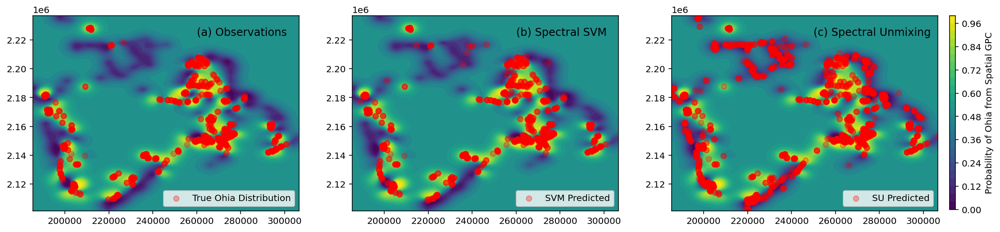

# Ohi'a Population Distribution with a Spatial Gaussian Process Classifier


```python
# libraries
import numpy as np
import matplotlib.pyplot as plt
import pandas as pd
import seaborn as sns
from pickle import dump, load

# scikit learn for gaussian process classification with standard RBF kernel
from sklearn.gaussian_process import GaussianProcessClassifier
from sklearn.gaussian_process.kernels import RBF

# just to make plots look nice
from matplotlib import rc
rc('font',**{'family':'sans-serif','sans-serif':['DejaVu Sans'],'size':12})
rc('mathtext',**{'default':'regular'})
get_ipython().run_line_magic('matplotlib', 'inline')
get_ipython().run_line_magic('config', "InlineBackend.figure_format = 'retina'")
from mpl_toolkits.axes_grid.inset_locator import (inset_axes, InsetPosition,
                                                  mark_inset)
```

    /var/folders/6c/zgfzytc91m92h5lq1g2v3bv00000gn/T/ipykernel_6878/4243964347.py:18: MatplotlibDeprecationWarning: 
    The mpl_toolkits.axes_grid module was deprecated in Matplotlib 2.1 and will be removed two minor releases later. Use mpl_toolkits.axes_grid1 and mpl_toolkits.axisartist, which provide the same functionality instead.
      from mpl_toolkits.axes_grid.inset_locator import (inset_axes, InsetPosition,


```python
# import and manipulate data into useful forms
x       = np.load('x_all.npy')           # x-coordinate
y       = np.load('y_all.npy')           # y-coordinate
spectra = np.load('data_all.npy')        # spectra for SVM model
key     = np.load('key_all.npy')         # true observations
svm     = np.load('model_class_all.npy') # svm predicted at x,y
mesma   = np.load('mesma_all.npy')       # spectral unmixing predicted at x,y

x = x.astype('float')    
y = y.astype('float')
data = pd.DataFrame({'x':x, 'y':y, 'key':key,'svm':svm})
```


```python
# visualize experimental data
sns.scatterplot(data = data, x = x, y = y, hue = key, palette = 'viridis')
plt.show()
```


    

    


## Gaussian Process Classification for Spatial Ohia Population Distribution


```python
num = 100                                # defines the number of test points across the map in x- and y-direction
x_grid = np.linspace(min(x),max(x),num)
y_grid = np.linspace(min(y),max(y),num)

try:
    input_dict = load(open('spatialgpc1.p', 'rb'))
    out = input_dict['spatialgpc']
    acc = input_dict['accuracy']
    
except:
    # preliminaries
    def unison_shuffled_copies(a, b):     # function to shuffle samples in unison
        assert len(a) == len(b)
        p = np.random.permutation(len(a))
        return a[p], b[p]

    X = np.zeros((len(x), 2))             # just putting the variables into an easy to use form
    X[:,0] = x
    X[:,1] = y
    X,key = unison_shuffled_copies(X,key) # use the shuffled copies so training samples are randomized
    N = int(len(x)*0.6)                   # 70% of data used for training 

    # train gaussian process classifier on spatial coordinates
    kernel = 1.0 * RBF(1.0)
    gpc = GaussianProcessClassifier(kernel=kernel,random_state=0).fit(X[:N], key[:N])
    acc = gpc.score(X[N:], key[N:])

    # evaluate the gaussian process classifier over a spatial map of the island (takes ~20 minutes)
    num = 100                               # defines the number of test points across the map in x- and y-direction
    x_grid = np.linspace(min(x),max(x),num)
    y_grid = np.linspace(min(y),max(y),num)
    out = np.zeros((num,num))               # define variable for spatial map

    j = 0
    for xval in x_grid:
        i = 0
        for yval in y_grid:
            testInput = np.array([[xval,yval]])
            out[i,j]  = np.abs(1-gpc.predict_proba(testInput)[0,0])
            i += 1
        j += 1
        print(j)
        
    output_dict = dict(spatialgpc = out, accuracy = acc)
    dump(output_dict, open('spatialgpc1.p', 'wb'))
```

    1
    2
    3
    4
    5
    6


```python
# visualize spatial GPC results vs spectroscopic SVM and spectral unmixing results
fig, axs = plt.subplots(1, 3, figsize=(18, 4))
axs[0].contourf(x_grid, y_grid, out, levels = 25, cmap = 'viridis')
axs[0].scatter(x[np.where(key == 1)], y[np.where(key == 1)], color='r', alpha = 0.3, label = 'True Ohia Distribution')
axs[0].text(260000, 2.223e6, '(a) Observations', fontsize = 12)
axs[0].legend(loc = 'lower right')
axs[1].contourf(x_grid, y_grid, out, levels = 25, cmap = 'viridis')
axs[1].scatter(x[np.where(svm == 1)], y[np.where(svm == 1)], color='r', alpha = 0.3, label = 'SVM Predicted')
axs[1].text(260000, 2.223e6, '(b) Spectral SVM', fontsize = 12)
axs[1].legend(loc = 'lower right')
CS = axs[2].contourf(x_grid, y_grid, out, levels = 25, cmap = 'viridis')
axs[2].scatter(x[np.where(mesma == 0)], y[np.where(mesma == 0)], color='r', alpha = 0.3, label = 'SU Predicted')
axs[2].text(250000, 2.223e6, '(c) Spectral Unmixing', fontsize = 12)
axs[2].legend(loc = 'lower right')
cbar_ax = fig.add_axes([0.91, 0.13, 0.005, 0.75])
cbar = fig.colorbar(CS, cax=cbar_ax)
cbar.ax.set_ylabel('Probability of Ohia from Spatial GPC')
plt.show()
```


    

    


```python
print(acc)
```

    0.93354


```python

```
